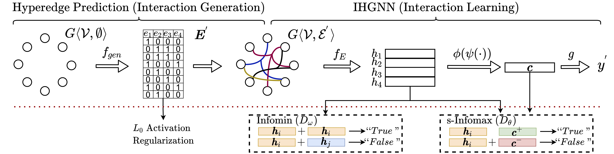

# Detecting Arbitrary Order Beneficial Feature Interactions for Recommender Systems (HIRS)

This is our implementation for the paper <!-- [link]()--->:

Yixin Su, Yunxiang Zhao, Sarah Erfani*, Junhao Gan, Rui Zhang, **Detecting Arbitrary Order Beneficial Feature Interactions for Recommender Systems **. *Conference on Knowledge Discovery and Data Mining* (KDD) 2021.

## Description

Detecting beneficial feature interactions is essential in recommender systems, and existing approaches achieve this by examining all the possible feature interactions. However, the cost of examining all the possible higher-order feature interactions is prohibitive (exponentially growing with the order increasing). Hence existing approaches only detect limited order (e.g., combinations of up to four features) beneficial feature interactions, which may miss beneficial feature interactions with orders higher than the limitation. 

<p align="center">
  
  <p align="center"><em>Figure1: Left: existing studies detect beneficial feature interactions within limited orders by examining all the possible feature interactions. Right: we detect arbitrary order beneficial feature interactions by directly generating them with our deep-infomax-based methods (s-Infomax and Infomin). </em></p>
</p>

In this work, we propose a hypergraph neural network based model named HIRS. HIRS is the first work that directly generates beneficial feature interactions of arbitrary orders and makes recommendation predictions accordingly. The number of generated feature interactions can be specified to be much smaller than the number of all the possible interactions and hence, our model admits a much lower running time. To achieve an effective algorithm, we exploit three properties of beneficial feature interactions, and propose deep-infomax-based methods to guide the interaction generation. <!-- Our experimental results show that HIRS outperforms state-of-the-art algorithms by up to 5% in terms of recommendation accuracy.-->

<p align="center">
  
  <p align="center"><em>Figure2: An Overview of HIRS. The part above the red dotted line is the recommendation prediction component (RPC). The part below the red dotted line is the s-Infomax and Infomin component and the L0 activation regularization, which is only conducted during training.</em></p>
</p>

## What are in this Repository
This repository contains the following main contents:

```
/
├── code/                         
|   ├── layers/                     
|   |   ├── discriminator.py  --> (The descriminator functions for s-Infomax and Infomin)
|   |   ├── edgepred.py       --> (The function for hyperedge prediction)
|   |   ├── hgnn.py           --> (The function of hypergraph neural network)
|   |   ├── infomax.py        --> (The functions of s-Infoamx and Infomin)
|   |   ├── readout.py        --> (The readout function for the final prediction)
|   ├── models/                
|   |   ├── hyperinfomax.py   --> (The main structure of the HIRS model)
|   ├── utils/                  
|   |   ├── dataloader.py     --> (The code to proceed the data into code-usable format)
|   |   ├── process.py        --> (Some evaluation functions)
|   ├── main.py               --> (The main function of the code)
├── data/                   
|   ├── book-crossing/        --> (The book-crossing dataset)
|   ├── ml-1m/                --> (The movielens dataset)
├── img/                      --> (The images for README (not used for the code))   
├── LICENCE                   --> (The licence file)
├── requirements.txt          --> (The required packages)
```

## Run our code

To run our code, please follow the instructions in our [code/](code/) folder.

## Cite our paper

Please credit our work by citing the following paper:

```
@inproceedings{su2022detecting,
  title={Detecting Arbitrary Order Beneficial Feature Interactions for Recommender Systems},
  author={Yixin, Su and Yunxiang, Zhao and Sarah, Erfani and Junhao, Gan and Rui, Zhang},
  booktitle={Proceedings of the Conference on Knowledge Discovery and Data Mining (KDD)},
  year={2022}
}
```
